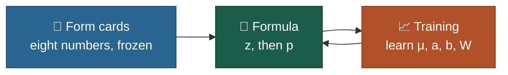
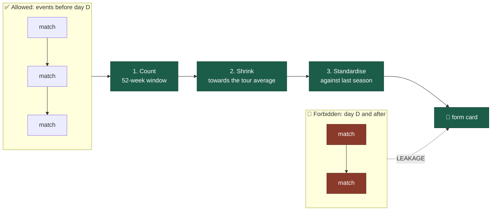
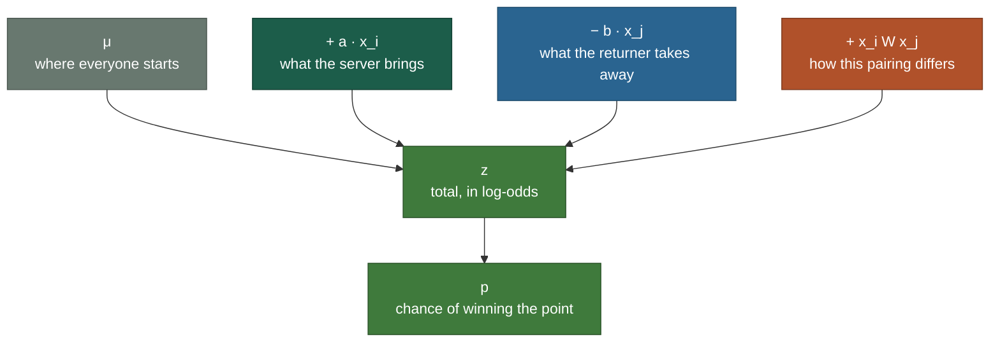
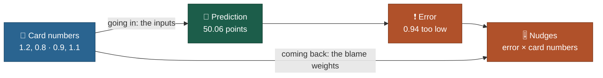
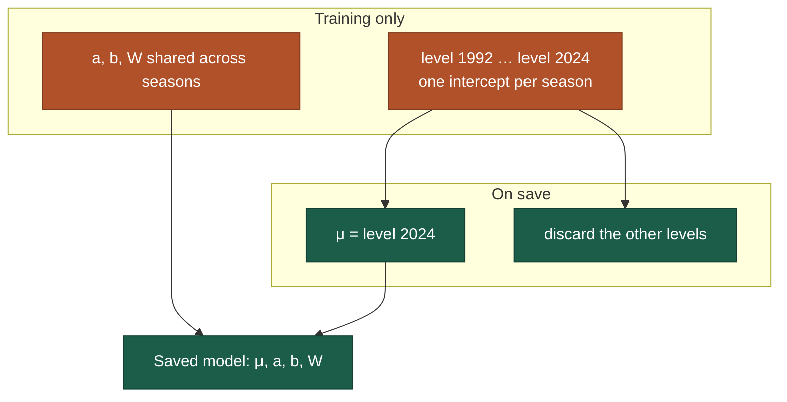

# Design 2.0: form cards, formula and training

The story and the season results live in [`README.md`](README.md). This file covers only the
three things the model is made of: **how a form card is built**, **the serve formula**, and
**how μ, a, b and W are learned**.

Every exact card and row definition, down to the column, is in
[`verification/VERIFY_SPEC.md`](verification/VERIFY_SPEC.md). The Run 1 write-up with its
holdout numbers is [`docs/serve_level_fix.md`](docs/serve_level_fix.md).

---

## 🪪 1. Form cards

Before each match the model gets a short report on each player, describing him **as he was
when the event began**. Eight numbers, built from his previous matches and scaled against
last season's players, so that **0 means tour average** and 1 means one standard deviation
above it. A player with only a handful of matches is pulled towards average rather than
believed. Surface is not
on the card: Hard, Clay and Grass each get their own copy of the formula instead.

| # | Attribute | Built from | Window |
| --- | --- | --- | --- |
| 1 | Serve strength | share of service points won | 52 weeks |
| 2 | Ace rate | aces per service point | 52 weeks |
| 3 | Double fault rate | double faults per service point | 52 weeks |
| 4 | Return strength | share of return points won | 52 weeks |
| 5 | Break points saved | saved / faced | 52 weeks |
| 6 | Break points converted | converted / chances | 52 weeks |
| 7 | Form | service points won, last 10 matches against the 52-week level | 10 matches |
| 8 | Age | date of birth | on the day |

In the code the eight are stored as `x_0` to `x_7`, in this order.

> [!CAUTION]
> **The one rule that cannot be broken.** A card for an event that starts on day D may only use
> matches from events that started before D: nothing from day D itself or later. Let one later
> match slip in and the model is reading tomorrow's newspaper: it looks brilliant and predicts
> nothing. That is why `tests/test_leakage.py` is the test that must pass first.

### How a card is built, in three steps

**1. Count.** Add up his match statistics over the 52 weeks before the event (day D − 364 up
to the day before D), across every surface. Form uses only his last 10 matches in that window.

**2. Shrink.** A rate built on a few matches is mostly noise, so each one is pulled towards last
season's tour average, as if the player had also played K extra points at exactly that average:

$$
\text{rate} = \frac{\text{points won} + K \cdot \text{tour average}_{Y-1}}{\text{points played} + K}
$$

| | Serve | Aces | Double faults | Return | Break points saved | Break points converted |
| --- | ---: | ---: | ---: | ---: | ---: | ---: |
| K | 200 | 50 | 250 | 300 | 200 | 350 |

K is counted in the rate's own points: service points, return points or break points. The
noisier the statistic, the bigger K, and the harder a thin sample is pulled towards average. A player with no
history lands exactly on the tour average. **Form** is the shrunk last-10 serve rate minus the
shrunk 52-week serve rate, so it stays at 0 until he has more than 10 matches in the window.

**3. Standardise.** Each value is measured against last season's population of players:

$$
x = \frac{\text{value} - \text{mean}_{Y-1}}{\text{standard deviation}_{Y-1}}
$$

Using last season's figures means a card never sees a number computed from its own future. It
also means **x = 0 is simply last season's average**: the cards carry no sense of how good
serving was in that era. That level lives only in μ, which is exactly what Run 1 fixes (§3.3).

Age comes from the date of birth; a missing or suspect one counts as average (0). 1991 is the
warm-up year: its cards feed the 1992 figures, and training rows start in 1992.

### From cards to training rows

Every valid Hard, Clay or Grass match from 1992 onward becomes **two rows**, one per server.
Each row holds the server's card, the returner's card, and the server's points served and won.
It never holds who won the match, the score, ranks, names or seeds.

Code: `atp_sim/form_cards.py` and `atp_sim/dataset.py`, run by `scripts/build_rows.py` into
`runs/cards.parquet` and `runs/rows.parquet`.

---

## 🧮 2. The formula

For player *i* serving to player *j* on one surface:

$$
z = \mu + \mathbf{a}^\top \mathbf{x}_i - \mathbf{b}^\top \mathbf{x}_j + \mathbf{x}_i^\top \mathbf{W}\, \mathbf{x}_j,
\qquad
p = \frac{1}{1 + e^{-z}}
$$

The first part adds up reasons; the second turns the total into a probability.

### 2.1 What each term is allowed to do

| Term | Size | Job | Must not do |
| --- | --- | --- | --- |
| μ | 1 | the absolute serve level on this surface | soak up "player i is good"; that is **a** |
| a | 8 | which card numbers help the server | encode era drift (cards are within-season) |
| b | 8 | which card numbers help the returner | the same |
| W | 8 × 8 | style against style | replace μ; it is a small correction around the linear terms |

**243 numbers in total:** 81 per surface, for Hard, Clay and Grass. Carpet is never trained. The
form cards are **inputs** and never change during learning; only μ, a, b and W move.

Why log-odds and then a squash? Adding in probability space can leave the range 0 to 1; adding in
log-odds is always safe, and the result is squashed back into a probability once at the end.

Code: `BilinearServeModel` in `atp_sim/model.py`. The prediction is always the formula above:
Run 0 and Run 1 differ only in training, never at prediction time.

---

## 📈 3. How it learns

### 3.1 One row, one nudge

A training row is the two cards, the surface, and the server's points served and won. Take the
README's example, shrunk to two attributes: Alcaraz serving to Sinner on clay, with Alcaraz's
card (1.2, 0.8) and Sinner's (0.9, 1.1). The model said Alcaraz would win 64.2% of his 78 service
points, which is 50.06. He won 51. **The prediction was 0.94 points too low**, and that one error
has to be shared out among the numbers that made it.

How much should each number move? The answer is not computed from anywhere. It is already
sitting in the sum, and a shopping bill shows why.

#### 🛒 A shopping bill

You buy 3 apples and 5 bananas. Apples cost *a* each, bananas cost *b* each:

$$
\text{bill} = 3a + 5b
$$

| Item | Bought | Put its price up by £1 and the bill goes up by |
| --- | ---: | ---: |
| Apples | 3 | £3 |
| Bananas | 5 | £5 |

Nobody calculated the £3 or the £5. They are just the quantities, already written in the bill
next to each price.

Now suppose the till says the bill should have been £0.94 higher than you worked out, and you
need to adjust your prices. Which one do you adjust more? The banana price, because bananas made
up more of this bill. You blame each price in proportion to how many of that item you bought.

> [!IMPORTANT]
> **Involvement = the quantity the price was multiplied by.** That is the whole idea.

#### The same shape in the model

Write out the prediction for this one row with the card numbers filled in:

$$
\begin{aligned}
z = \mu &+ a_1(1.2) + a_2(0.8) - b_1(0.9) - b_2(1.1) \\
&+ W_{11}(1.2 \times 0.9) + W_{12}(1.2 \times 1.1) + W_{21}(0.8 \times 0.9) + W_{22}(0.8 \times 1.1)
\end{aligned}
$$

It is the shopping bill again: every number the model learns is a price, each one is multiplied
by a quantity, and everything is added up.

| Number | Multiplied by | Involvement |
| --- | --- | ---: |
| μ | nothing, which is the same as 1 | 1 |
| a₁ | 1.2 | 1.2 |
| a₂ | 0.8 | 0.8 |
| b₁ | 0.9, and subtracted | −0.9 |
| b₂ | 1.1, and subtracted | −1.1 |
| W₁₁ | 1.2 × 0.9 | 1.08 |
| W₁₂ | 1.2 × 1.1 | 1.32 |
| W₂₁ | 0.8 × 0.9 | 0.72 |
| W₂₂ | 0.8 × 1.1 | 0.88 |

You do not work any of that out. You read it off the line.

#### The same numbers do two jobs

This is the step that is easy to miss: **the quantities are the form-card numbers.** 1.2 and 0.8
are Alcaraz's attributes; 0.9 and 1.1 are Sinner's. They do two jobs at once:

- **going in**, they are the inputs that produce the prediction;
- **coming back**, they are the blame weights that decide how far each number is nudged.

Same numbers, both directions. That is why involvement never has to be worked out separately.

> [!TIP]
> **Zero means no say.** If a player is exactly tour average on an attribute, his card holds 0
> there. None of that item went into the bill, so the numbers it multiplies had no part in the
> prediction, and it would be wrong to move them because the prediction was off.

#### The nudge, applied

> [!NOTE]
> **nudge = learning rate × how wrong we were × how involved that number was**

With a learning rate of 0.001 and the prediction 0.94 points too low, every number moves
in proportion to its involvement (up where the involvement is positive, down where it is negative):

| Number | Before | Involvement | Nudge | After |
| --- | ---: | ---: | ---: | ---: |
| μ | 0.49 | 1.00 | +0.00094 | 0.49094 |
| a₁ | 0.30 | 1.20 | +0.00113 | 0.30113 |
| a₂ | 0.05 | 0.80 | +0.00075 | 0.05075 |
| b₁ | 0.02 | −0.90 | −0.00085 | 0.01915 |
| b₂ | 0.25 | −1.10 | −0.00103 | 0.24897 |
| W₁₁ | −0.04 | 1.08 | +0.00102 | −0.03898 |
| W₁₂ | 0.03 | 1.32 | +0.00124 | 0.03124 |
| W₂₁ | 0.01 | 0.72 | +0.00068 | 0.01068 |
| W₂₂ | −0.02 | 0.88 | +0.00083 | −0.01917 |

Three things to notice:

- **The b weights move the other way on their own.** Nobody told them to: their involvement is
  negative because the formula subtracts them, so the same error pushes them down.
- **μ has involvement 1 whoever is playing.** It shifts every prediction equally, so it only
  settles once the model is right on average across the whole surface.
- **Nothing here is a search.** No values are tried and compared. Each number's share of the
  blame is one multiplication, and all 81 numbers of that surface's model move at once. That is
  all backpropagation is.

For the maths-minded: the quantity is the partial derivative of z with respect to that number,
and the error np − w is predicted minus actual points won (the opposite sign to "how wrong"
above, hence the minus), so each learned number θ moves by

$$
\theta \leftarrow \theta - \eta\,(n p - w)\,\frac{\partial z}{\partial \theta}
$$

with η the learning rate, n the points served and w the points won. In practice rows go through
in batches of 2,048 and Adam scales each step, but the direction of every nudge comes from exactly
this sum.

Repeat that over every row, many times, and the random nudges cancel while the systematic ones
add up, until nothing is moving.

### 3.2 Three surfaces, same recipe

`train_all_surfaces` fits Hard, Clay and Grass **independently**, each on its own rows. The saved
object is a `SurfaceBundle`: the 243 numbers, the card mean and standard deviation for
season `train_through` + 1 (the first unseen season), and `train_through`.

### 3.3 Run 0 and Run 1: only training differs

| | Run 0 · baseline | Run 1 · season anchor |
| --- | --- | --- |
| Formula at prediction time | `z = μ + a·x_i − b·x_j + x_iᵀWx_j` | **identical** |
| Intercept while training | one μ for all seasons | one level per season; the last training season is the anchor; the rest are discarded |
| What μ means once saved | about the pooled 1992 to `--train-through` rate | about the rate of `--train-through` (usually 2024) |
| Saved shape | 243 numbers | 243 numbers |

**Why Run 0 sits low.** The cards are standardised season by season, so they carry no
"serving got easier" signal. The absolute level lives only in μ. Fit μ on every row from 1992
onward and it settles near the 33-year average, about 1.2 to 1.6 percentage points below the
2024 tour, so the 2025 holdout reads systematically low.

**What Run 1 does while training.** Each row's season supplies the whole intercept
(`SeasonOffsets`): the model's μ is held at 0, and

$$
z = \mathrm{level}_{\text{season}} + \mathbf{a}^\top \mathbf{x}_i - \mathbf{b}^\top \mathbf{x}_j + \mathbf{x}_i^\top \mathbf{W}\, \mathbf{x}_j
$$

After the last epoch μ is set to the level of the anchor season (the last training season), the
other levels are dropped, and the model is saved as usual. The reported δ for each season is its
level minus the anchor's, so the anchor's δ is 0 by construction.

**Why a full level per season rather than μ plus a small δ.** μ and a per-season δ are nearly
interchangeable, so Adam crawls. One free intercept per season lets each year's rows set their
own level. The season levels carry no penalty: even a light one, summed over 32 seasons,
pulled the anchor measurably off its own data.

**Why the anchor is the last training season.** The model will be asked about season T+1, and
the freshest evidence about the tour's level is season T. The cards already use season Y−1's
figures for season Y, so it is the same idea. Retrain with `--train-through 2025` and the anchor
moves with no code change.

**What Run 1 does not change.** The form cards, how rows are built, the shape of a, b and W, the
formula at prediction time, and the saved model's size.

### 3.4 What is frozen and what is learned

| Piece | Frozen | Learned |
| --- | --- | --- |
| Form cards, shrinkage K, windows | yes, built once | no |
| Training rows (cards, points won, points served) | yes, for a given build | no |
| μ, a, b, W | no | yes, per surface |
| Season levels (Run 1) | discarded after training | yes, during training only |

---

## 4. Where to look next

| Want | Open |
| --- | --- |
| The story and the results | [`README.md`](README.md) |
| Exact row and card rules | [`verification/VERIFY_SPEC.md`](verification/VERIFY_SPEC.md) |
| Run 0 to Run 1 bias tables | [`docs/serve_level_fix.md`](docs/serve_level_fix.md) |
| Build and train commands | the README's Quick start; `scripts/build_rows.py`, `scripts/train_model.py` |

*Older narrative draft covering more of the stack: [`DESIGN.md`](DESIGN.md). Prefer this file for
cards, formula and training.*
