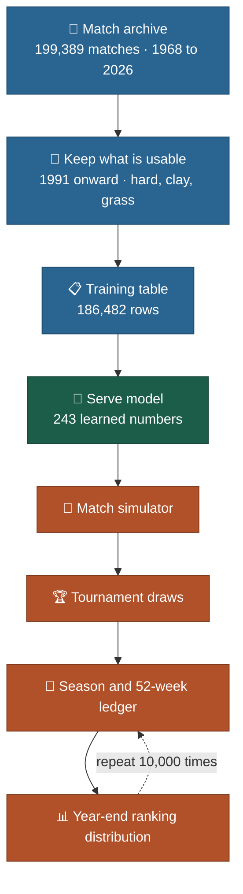
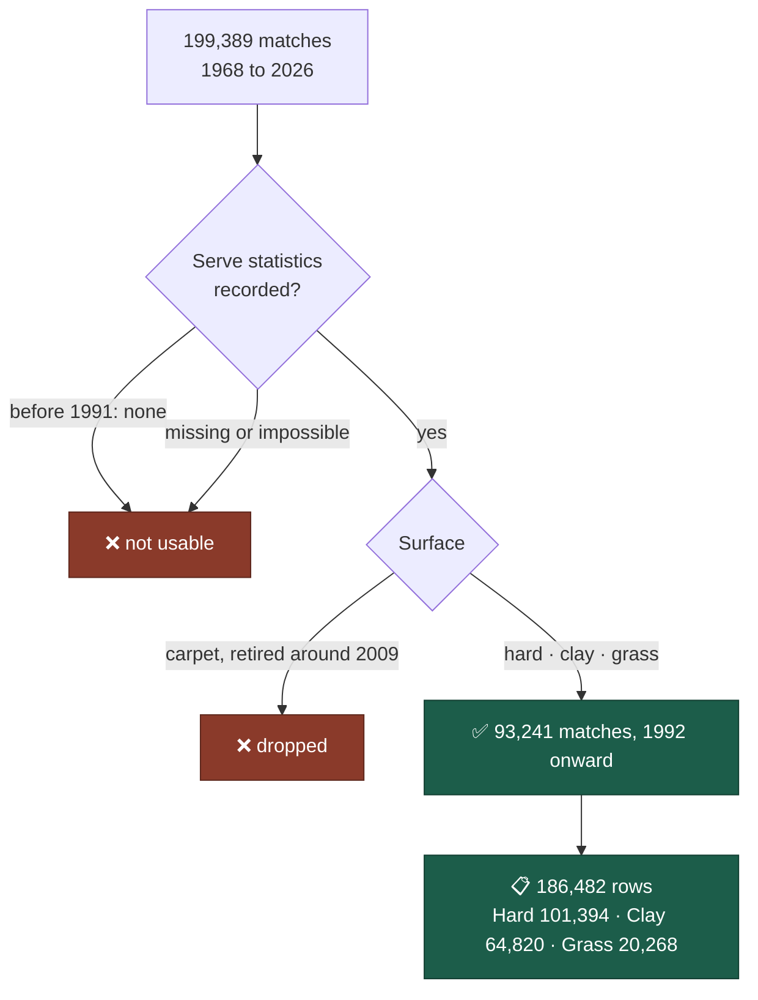
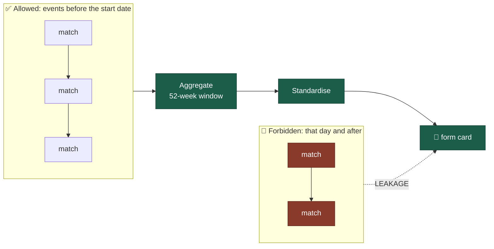
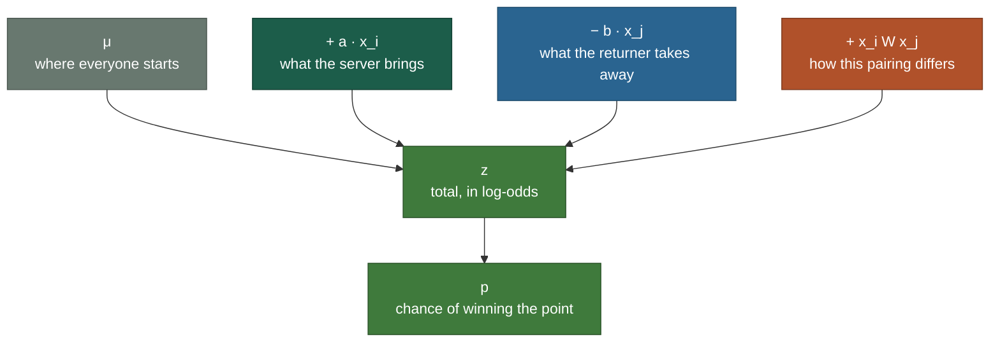
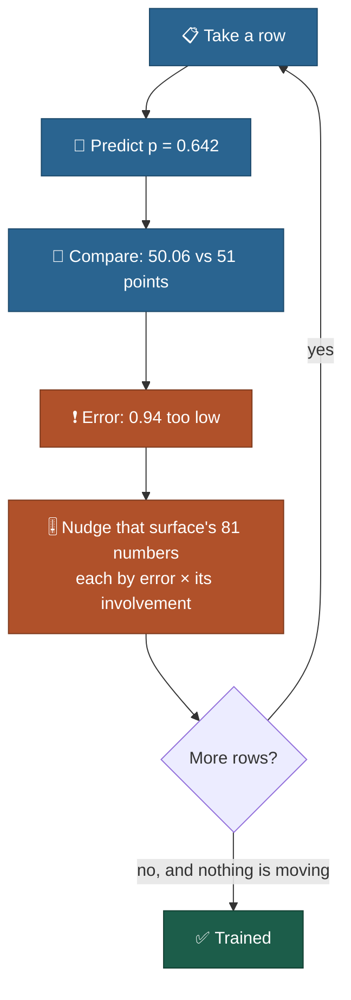
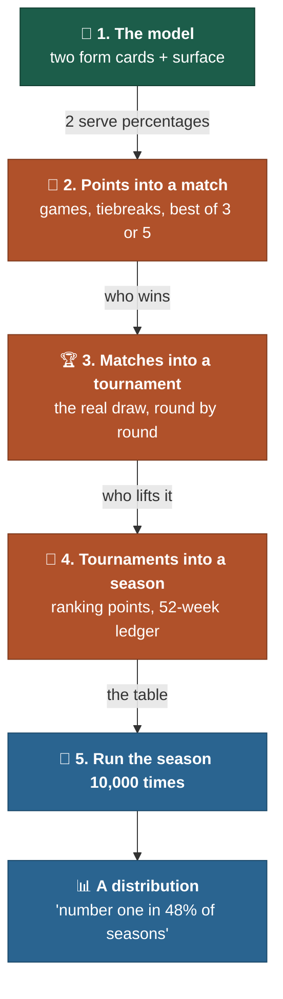
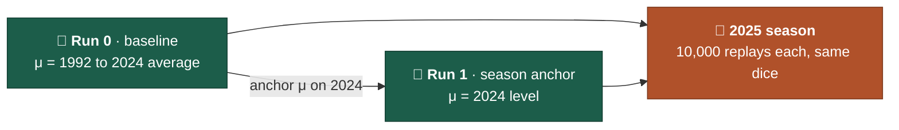

# 🎾 ATP Season Simulator

This repo explores a point-level model of professional tennis, used to replay whole ATP seasons and forecast
the year-end rankings. It learns one thing: how often a player wins a point on his own
serve. Everything else is built by repetition.

**Scope:** ATP singles on hard, clay and grass, 1991 onward (carpet matches count towards form cards only).  
**Status:** training table built and verified · two frozen models (Run 0 and Run 1) · the
2025 season simulated 10,000 times with each · 83 tests.  
**Technical design:** [`DESIGN.md`](DESIGN.md) covers form cards, formula and training; the story stays here. Data provenance: [`docs/data_provenance.md`](docs/data_provenance.md). Exact definitions: [`verification/VERIFY_SPEC.md`](verification/VERIFY_SPEC.md).

---


## 🧱 The whole thing rests on one number

A tennis season looks impossibly complicated. Sixty-odd tournaments, hundreds of players,
thousands of matches, a ranking table that reshuffles every Monday. All of it is built from
one repeated event.

> [!IMPORTANT]
> **How often does this player win a point when he is serving?**
> Everything else in this project is that number, repeated and stacked.

At least four points win a game, six games a set, two or three sets a match, up to seven
matches a title, and a year of titles makes a ranking.




---


## 📁 Where the data comes from

Every professional match has an official record: who played, who won, and counting
statistics such as first serves in, points won, aces, double faults and break points. Jeff
Sackmann of Tennis Abstract collected these into the public archive most tennis research is
built on.

> [!NOTE]
> **The data has been checked against other sources.** Every match from 1992 to 2026 was
> compared with a second dataset (TennisMyLife): 99.8% appear in both, the winner differs in
> only 3 of 108,801, and of the 98,272 matches where both have serve statistics, 99.1% agree
> on all 16. Because that dataset was
> partly built from Sackmann's, 12 random matches, three per decade, were also checked against
> the official ATP website, and all 12 matched on every serve statistic. Full write-up:
> [data source verification](verification/reports/DATA_SOURCE_VERIFICATION.md).




Rows start in 1992 because 1991 is the warm-up year: it fills the first 52-week windows and
sets the first standardising constants. Each match becomes
**two rows**, one per server. Using Alcaraz and Sinner as an illustration (the figures are made up):


| Server  | Returner | Surface | Points served | Points won |
| ------- | -------- | ------- | ------------- | ---------- |
| Alcaraz | Sinner   | Clay    | 78            | 51         |
| Sinner  | Alcaraz  | Clay    | 81            | 49         |


Note what is missing: who won the match. The model only ever learns about service points.
Match results are held back as an independent test of whether it is any good.

---


## 🪪 The form card

Before each match the model gets a short report on each player, describing him **as he was
when the tournament began**. Eight numbers, built from his previous matches and scaled
against the previous season's players, so that **0 means tour average** and 1 means one
standard deviation above it. A player with only a handful of matches is pulled towards
average rather than believed.


| #   | Attribute              | Built from                                                    | Window     |
| --- | ---------------------- | ------------------------------------------------------------- | ---------- |
| 1   | Serve strength         | share of service points won                                   | 52 weeks   |
| 2   | Ace rate               | aces per service point                                        | 52 weeks   |
| 3   | Double fault rate      | double faults per service point                               | 52 weeks   |
| 4   | Return strength        | share of return points won                                    | 52 weeks   |
| 5   | Break points saved     | saved / faced                                                 | 52 weeks   |
| 6   | Break points converted | converted / chances                                           | 52 weeks   |
| 7   | Form                   | service points won, last 10 matches minus the 52-week level   | 10 matches |
| 8   | Age                    | date of birth                                                 | on the day |

In the code the eight are stored as `x_0` to `x_7`, in this order.

> [!CAUTION]
> **The one rule that cannot be broken.** A card for a tournament starting on 5 June 2019 may
> only use matches from events that started before 5 June 2019. Let one later match slip in and the model is reading
> tomorrow's newspaper: it looks brilliant and predicts nothing. The failure is silent, which
> is why the first test written for this project is a leakage test.




Surface is not one of the eight: the model is fitted three separate times, once per surface.

---


## 🧮 The formula

For player *i* serving to player *j* on one surface:

$$
z = \mu + \mathbf{a}^\top \mathbf{x}_i - \mathbf{b}^\top \mathbf{x}_j + \mathbf{x}_i^\top \mathbf{W}\, \mathbf{x}_j,
\qquad p = \frac{1}{1 + e^{-z}}
$$

The first part adds up reasons; the second turns the total into a probability.




One prediction, shrunk to two attributes (serve strength and return strength) so the arithmetic
is easy to follow:


| Layer         | In plain words                                | Alcaraz serving to Sinner, clay |
| ------------- | --------------------------------------------- | ------------------------------- |
| μ             | the tour average on this surface, in log-odds | 0.490                           |
| + a · x_i     | what Alcaraz brings                           | +0.400                          |
| − b · x_j     | what Sinner takes away                        | −0.293                          |
| + x_i W x_j   | style against style                           | −0.014                          |
| **z, then p** | the total, squashed into a probability        | **0.583, so 64.2%**             |


Why squash at all? Probabilities must stay between 0 and 1, and adding does not respect that (64% plus 20% plus 25% is 109%). So the sums happen in log-odds, where adding is always safe, and the total is converted once at the end.

> [!TIP]
> **243 numbers is the entire model:** 81 per surface (μ, 8 in **a**, 8 in **b**, 64 in
> **W**), fitted three times. The form cards are inputs and never change; only these numbers
> are learned. **W** has the most numbers and the least influence, as the example shows:
> −0.014 against 0.400.

---


## 📈 How it learns

In that example Alcaraz served 78 points and won 51. The model said 64.2%, which is
50.06 points: 0.94 points too low. That one error nudges all 81 numbers of the clay model at once.

> [!NOTE]
> **nudge = learning rate × how wrong we were × how involved that number was**

"Involved" means how far the prediction would move if that number moved. A weight that
multiplies a large attribute is a long lever and takes a big share of the blame; one that
multiplies zero sits at the pivot and takes none. Across the 178,818 training rows (1992 to 2024) the random nudges cancel
and the systematic ones add up, until every number stops moving.




Why each number moves as much as it does, explained with a shopping bill and every nudge worked
out by hand: [`DESIGN.md` §3.1](DESIGN.md#31-one-row-one-nudge). Run 0 against Run 1
is in [§3.3](DESIGN.md#33-run-0-and-run-1-only-training-differs).

---


## 🏆 From one point to a ranking

Give the model two form cards and a surface and it returns two serve percentages, one for
each player. Everything above that is repetition.




Tennis scoring works like a gearbox: a small difference in serve percentage comes out as a
large difference in match odds, because it is applied to every point of every game.


| Player A wins on serve | Player B wins on serve | A wins, best of 3 | A wins, best of 5 |
| ---------------------- | ---------------------- | ----------------- | ----------------- |
| 62%                    | 62%                    | 50.0%             | 50.0%             |
| 65%                    | 58%                    | 81.4%             | 86.8%             |


The surface sets the starting point: from 2016 to 2026, servers won 65.9% of points on grass,
64.2% on hard and 61.9% on clay.

The simulator plays the real 2025 draws, rebuilt from the results, awards the 2025 ATP
points and rolls the 52-week ledger. Both models face exactly the same random numbers, like
two cars in a wind tunnel with identical gusts, so any difference in the results is the
model's. How it works: [`docs/season_simulation.md`](docs/season_simulation.md).

---


## 🧪 Results so far




|                                         | Run 0 · baseline | Run 1 · season anchor | For reference                   |
| --------------------------------------- | ---------------- | --------------------- | ------------------------------- |
| 2025 hard-court serve bias (pp)         | −1.5 pp          | **−0.4 pp**           | 0 is perfect                    |
| Match log loss, 2,622 real 2025 matches | 0.6895           | **0.6545**            | coin flip 0.6931                |
| Match accuracy                          | 61.0%            | 61.6%                 | higher-ranked player wins 64.3% |
| Most likely year-end #1                 | Alcaraz, 47.7%   | Sinner, 70.9%         | real #1: Alcaraz                |


> [!NOTE]
> **The main finding so far: both models are overconfident.** Players Run 0 rates at 90% or
> more (95% on average) win 81% of the time; for Run 1 the figure is 87%. The gearbox magnifies any error
> in the serve percentages, and the model treats its estimates as exact. Allowing for that
> uncertainty is the next run. On accuracy, both still trail "the higher-ranked player wins".

More detail: [model runs](verification/reports/MODEL_PROGRESSION.md) ·
[the Run 0 to Run 1 fix](docs/serve_level_fix.md) ·
[the 2025 simulations](verification/reports/simulations_2025.md).

---


## 🚀 Quick start

```bash
git clone https://github.com/MacMac2070/atp-tennis-simulator.git
cd atp-tennis-simulator
python3 -m venv .venv && source .venv/bin/activate   # Python 3.10 or later
python -m pip install -r requirements.txt
./fetch_data.sh                       # download the match archive into data/
python audit_data.py                  # what the data can support
python scripts/build_rows.py          # build the training table in runs/ (a few seconds)
python -m pytest -q                   # 83 tests, leakage test included
python scripts/train_model.py --train-through 2024 --out runs/model.pt
python scripts/evaluate_model.py --model runs/model.pt
python scripts/simulate_season.py --model artifacts/models/run1_season_delta/model.pt \
    --season 2025 --n-sims 10000 --seed 42 --out runs/simulations/run1_season_delta/season_2025/
```

Training and simulation both write to `runs/`; the scripts refuse to write into
`artifacts/models/`, so the frozen runs are never overwritten. The simulation's CSV files and
`summary.md` should match those under `artifacts/simulations/` byte for byte, and `metrics.json`
agrees to about 8 decimal places across machines and library versions.

---


## 🗂️ Repository layout


| Path                             | What it holds                                                                                                                                                                  |
| -------------------------------- | ------------------------------------------------------------------------------------------------------------------------------------------------------------------------------ |
| `atp_sim/`                       | The package. Data and cards: `data.py`, `form_cards.py`, `dataset.py`. Model: `model.py`, `train.py`. Simulator: `match.py`, `draws.py`, `points.py`, `season.py`, `report.py` |
| `scripts/`                       | `build_rows.py`, `train_model.py`, `evaluate_model.py`, `simulate_season.py`, `compare_simulations.py`                                                                         |
| `tests/`                         | The pytest suite; `test_leakage.py` guards the one rule that cannot be broken                                                                                                  |
| `artifacts/models/`              | Frozen weights for each run: `run0_baseline/`, `run1_season_delta/`                                                                                                            |
| `artifacts/simulations/`         | Simulation outputs for each run, one `season_YYYY/` folder per replayed season                                                                                                 |
| `docs/`                          | Explainers: the serve level fix, the season simulation, the data provenance                                                                                                    |
| `verification/`                  | The exact definitions (`VERIFY_SPEC.md`), independent checks and all reports                                                                                                   |
| `DESIGN.md`                      | Technical design: the card, formula and training rules, and why; the experiments still to run                                                                                  |
| `fetch_data.sh`, `audit_data.py` | Download the archive; report what it can support                                                                                                                               |
| `LICENSE`, `LICENSE-DATA.md`     | MIT for the code; CC BY-NC-SA 4.0 for the match data and the files derived from it                                                                                             |
| `data/`, `runs/`                 | The downloaded archive and local build outputs; gitignored                                                                                                                     |


---


## 🚫 What this is not

- **Not a betting model.** It is a study of how far a transparent, readable model can get, not an
attempt to beat a market.
- **Not live.** The archive stops with Roland Garros 2026, so the simulator replays completed
seasons rather than forecasting the current one.
- **Not a shot-level model.** The archive records serve and return counts only, so the model
knows nothing about footwork, forehands or court position.
- **Not an injury forecaster.** A retirement in week three wrecks a season forecast, and
nothing in the data would have warned of it.
- **Not the full ranking rules.** In the simulator every event counts in full (no best-19 rule).
- **Not a free-running season.** Form cards stay at their real values and the ATP Finals field is
the real one, so simulated results never feed back.

A model that says what it cannot do is easier to trust about what it can.

---


## 📜 Data and licence

Match data compiled by Jeff Sackmann (Tennis Abstract) and used under
[CC BY-NC-SA 4.0](https://creativecommons.org/licenses/by-nc-sa/4.0/): non-commercial,
attribution required, share-alike. The original repository was withdrawn in 2026;
`fetch_data.sh` downloads a pinned archival mirror of the same files, which run to tournaments
starting 25 May 2026 and are not redistributed here in full. Full provenance:
[`docs/data_provenance.md`](docs/data_provenance.md).

The code in this repository is released under the [MIT licence](LICENSE). The files derived
from the match data (the model weights and simulation outputs under `artifacts/`, and the sample
rows and match-level figures in `verification/`) stay under the data's CC BY-NC-SA 4.0 licence:
see [`LICENSE-DATA.md`](LICENSE-DATA.md).

---

*Data originally compiled by Jeff Sackmann (Tennis Abstract), used under CC BY-NC-SA 4.0 via an
archival mirror after the original repository was withdrawn. Point-to-match calculation follows
the standard recursive construction used in the tennis modelling literature; the interaction
term follows the blade-chest approach to intransitivity in matchup data (Chen and Joachims,
2016).*
