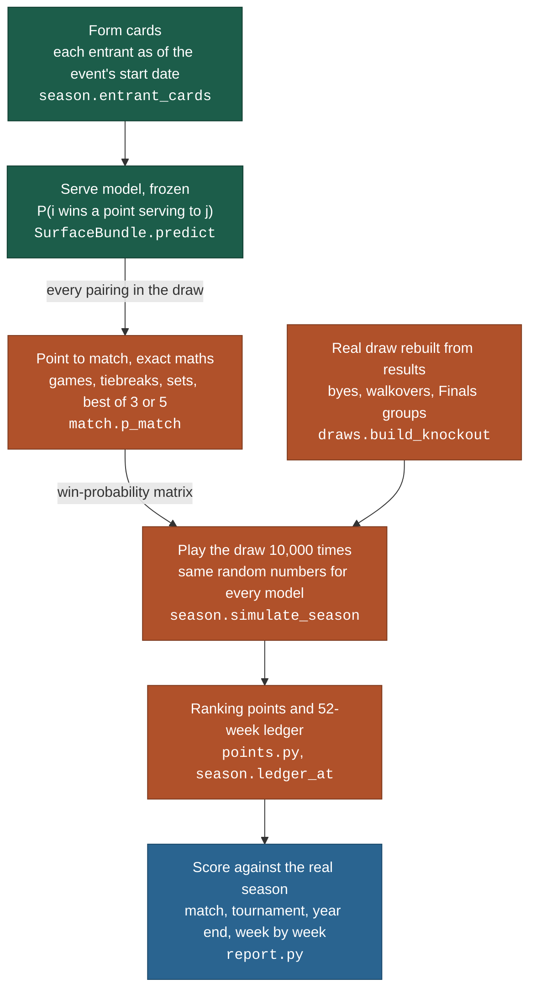

# Season simulation: how it works and what it found

**In one line:** the 2025 season is replayed 10,000 times with its real draws for each
of the two frozen serve models, and both sets of replays are scored against what actually happened.

The prediction formula does not change. The simulator only consumes it:
`z = μ + a·x_i − b·x_j + x_iᵀWx_j`, per surface, exactly as in
[`DESIGN_2.0.md` §2](../DESIGN_2.0.md#-2-the-formula).

---

## The stack as built



### 1. Serve model, from cards to percentages

Each player gets the form card he actually had on the event's start date, built from real
matches before that date only. The frozen model turns every pair of cards into two serve
percentages. This is the only step where Run 0 and Run 1 differ.

### 2. Point to match: a gearbox

Tennis scoring is a gearbox. A small difference in serve percentage comes out as a large
difference in match odds, because it is applied to every point of every game of every set.

| Server A | Server B | A wins (best of 3) | A wins (best of 5, Slam) |
|---:|---:|---:|---:|
| 62% | 62% | 50.0% | 50.0% |
| 65% | 58% | 81.4% | 86.8% |
| 64% | 62% | 59.9% | 62.4% |

These are exact: games, tiebreaks (serve order A, BB, AA, ...), sets and matches are
recursions, not simulations, and a point-by-point Monte Carlo replay of 20,000 matches is
the independent check in `tests/test_match.py`. The 10-point deciding-set tiebreak at the
Grand Slams is included. Who serves first turns out not to matter, which the tests confirm.

### 3. The draws are rebuilt from the results

The archive has results, not draw sheets. But in a knockout draw every player in a round
either won a match in the round before or had a bye, so linking each match to the two it
was fed by recovers the exact tree. All 60 events of 2025 rebuild, and the check raises an error on
anything that does not fit. The CSV's own `draw_size` is not trusted: it is wrong for 39
events in 2024.

### 4. Points and the ledger

The 2025 ATP table by category, draw size and round, with the bye rule (a bye then a loss
scores first-round points) and the ATP Finals (200 per group win, 400 for winning the semi-final,
500 for winning the final). Checked independently in
`verification/antigravity/simulation_review/points_table_check.md`, and against reality:
scoring the real 2025 results with this table reproduces Alcaraz's 12,050 and Sinner's
11,500 official year-end points exactly.

### 5. Repeat, with the same dice

Every match slot of every event has its own random numbers, fixed by the seed. Both models
face exactly the same dice, like a wind tunnel run twice with identical gusts, so any
difference between the two result folders is the model's.

---

## What it found (10,000 seasons, seed 42)

| | Run 0 · baseline | Run 1 · season anchor | Reference |
|---|---:|---:|---:|
| Match accuracy (2,622 real matches) | 61.0% | 61.6% | 64.3% higher-ranked player |
| Match log loss (coin flip 0.6931) | 0.6895 | **0.6545** | |
| Real champion was the favourite | 15 of 60 | 17 of 60 | |
| Real champion in the top three | **31 of 60** | 27 of 60 | |
| Most likely year-end #1 | Alcaraz, 47.7% | Sinner, 70.9% | Alcaraz |
| Rank error vs same-table, official top 20 | 7.5 | **6.6** | |

Three findings:

1. **Both models are overconfident.** Players Run 0 rates at 90% or more (95% on average) win
   81% of the time; for Run 1 the figure is 87%. The gearbox is the reason: it magnifies any error in the serve
   percentages, and the model treats its estimates as exact. Allowing for that uncertainty
   would pull every match probability towards 50%. That would improve log loss but not
   accuracy, where both trail "the higher-ranked player wins" (61.0% and 61.6% against 64.3%).
2. **Run 1 is the better model on most scores:** match log loss overall, on hard and clay and in every
   tournament category, tournament log loss, Spearman and rank error. Anchoring μ on 2024
   fixed the serve level, and the match odds improved with it. It is slightly worse on
   grass match log loss (0.6575 against 0.6550), less accurate on grass (60.7% against 62.0%),
   ATP 250 and ATP 500 matches, and puts the real champion in its top three less often (27
   events against 31).
3. **Run 1 is wrong about the year-end #1.** It rates Sinner so highly that he finishes
   first in 71% of simulated seasons, but Alcaraz was the real year-end #1. Run 0's Alcaraz call came with an
   odd rating of De Minaur, who averages 8,075 simulated points against 4,090 real ones.
   Being right about one player is weak evidence; the aggregate scores are the fairer test.

Full tables: `verification/reports/simulations_2025.md`, and each run's
`artifacts/simulations/run*/season_2025/summary.md`.

**An independent check.** A second simulator, built separately for comparison and not kept, agreed
on every match probability. Its outputs are not in this repository.

---

## What is simplified

- Form cards are frozen at each event's real start date; simulated results never feed back
  into later cards. This is an A/B test of the serve model, not a closed fantasy season.
- Every real entrant plays and nobody else; injuries, withdrawals and retirements are not
  simulated, and every match is played to a finish.
- Every simulated event counts in full: no best-19 rule, mandatory-event zero-pointers or
  protected rankings, and no Challenger, qualifying or United Cup points. That is why year-end results
  are compared with the same-table actual race first and the official ranking second.
- ATP Finals groups are the real ones; games won % is not simulated, so an unbroken
  three-way group tie falls to the entry ranking.

## Reproduce

These write to `runs/` (gitignored), so the frozen results under `artifacts/simulations/` are
never overwritten; every CSV file and `metrics.json` should match them byte for byte.

```bash
python scripts/simulate_season.py --model artifacts/models/run0_baseline/model.pt \
    --season 2025 --n-sims 10000 --seed 42 --out runs/simulations/run0_baseline/season_2025/
python scripts/simulate_season.py --model artifacts/models/run1_season_delta/model.pt \
    --season 2025 --n-sims 10000 --seed 42 --out runs/simulations/run1_season_delta/season_2025/
python scripts/compare_simulations.py --season 2025 --out runs/simulations/simulations_2025.md \
    runs/simulations/run0_baseline runs/simulations/run1_season_delta
```

Each run takes about ten seconds.
