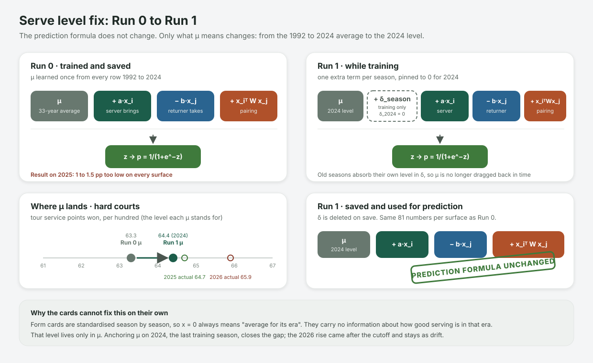
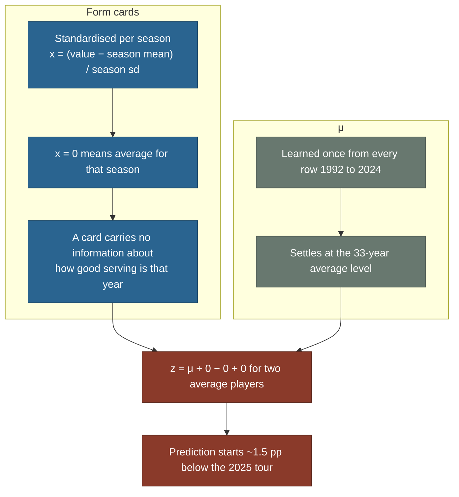

# Serve level fix: Run 0 to Run 1

Run 0 under-predicts service points won by 1 to 3 points per hundred on the held-out 2025 and 2026 seasons. This note explains why, what Run 1 changes, and what it leaves alone.

## Is the formula changing?

| | Prediction time (what the simulator calls) | Training time only |
|---|---|---|
| Run 0 | `z = μ + a·x_i − b·x_j + x_iᵀWx_j` | same |
| Run 1 | `z = μ + a·x_i − b·x_j + x_iᵀWx_j` **(identical)** | `z = μ + δ_season + a·x_i − b·x_j + x_iᵀWx_j`, with `δ_2024 = 0` |

The saved model, its shape (81 numbers per surface) and the prediction formula do not change. What changes is **what μ means**. In Run 0, μ is the 1992 to 2024 average serve level. In Run 1, μ is the 2024 level. The δ values are training scaffolding that let old seasons contribute to `a`, `b` and `W` without dragging μ backwards in time, and they are deleted on save.

## What Run 0 found

Model trained through 2024, scored on 2025 and January to May 2026. `bias = predicted − actual`.

| Surface | Holdout rows | Actual | Predicted | Bias |
|---|---|---|---|---|
| Hard | 4,500 | 0.6502 | 0.6316 | **−0.0186** |
| Clay | 2,574 | 0.6234 | 0.6076 | **−0.0159** |
| Grass | 590 | 0.6602 | 0.6499 | **−0.0103** |

Full tables: `verification/reports/run0_baseline/eval.md`. The data was verified against TennisMyLife and atptour.com (`verification/reports/DATA_SOURCE_VERIFICATION.md`), so the bias is a modelling issue.

## Why

The form cards (`atp_sim/form_cards.py`, `standardise_cards`) are standardised against each season's own population, so `x = 0` means "average for that season" and the cards say nothing about the absolute level of the era. The only place the level lives is the scalar μ in `BilinearServeModel`, which is fitted on every row from 1992 and lands on the pooled 33-year rate.

Serve rates have crept up by about 0.06 points per hundred per year on hard and clay since 2005. Over three decades that puts the 2024 tour 1.1 to 1.5 pp above the pooled average:

| Surface | Pooled 1992 to 2024 (what Run 0 μ learns) | 2024 | 2025 actual | 2026 actual (to 17 May) |
|---|---|---|---|---|
| Hard | 0.6327 | 0.6443 | 0.6467 | 0.6586 |
| Clay | 0.6069 | 0.6203 | 0.6211 | 0.6271 |
| Grass | 0.6500 | 0.6655 | 0.6602 | none in archive |

The gap between the pooled level and 2024 is the whole of the 2025 bias. The further rise in 2026 is real (January to May rates in 2023 to 2025 match their full seasons) and happened after the training cutoff, so no model trained through 2024 can know it.

## What Run 1 does

During training, each season gets its own additive correction δ to μ. The last training season is pinned at δ = 0, so μ itself becomes the level of that season and the older seasons absorb "how much lower serving was back then". After training the δ vector is discarded.

- Each training row now carries its season (`rows_to_tensors` in `atp_sim/dataset.py`).
- `train_surface` in `atp_sim/train.py` adds `δ[season]` to the logit inside the loop. `BilinearServeModel.forward` is untouched.
- `SurfaceBundle.save` writes the same 243 numbers as before.
- Implementation detail: rather than μ plus a per-season δ (nearly collinear, so Adam crawls), training fits one full intercept per season and sets μ to the anchor's intercept at the end. Reported as δ = level − level(2024). The season levels are not regularised (a light L2 summed over 32 seasons pulled the anchor 0.5 pp off its data) and the learning rate is cooled linearly to 5% so the intercepts settle instead of jittering by about 1 pp (`--lr-decay`, default on).
- The evaluator gains a second baseline, "always guess the last training season's rate", which is the bar Run 1 has to beat. The old "pooled average" baseline becomes a straw man once μ is anchored.

| Thing | Run 0 | Run 1 |
|---|---|---|
| Form cards, point counts | frozen | frozen |
| μ, a, b, W | learned | learned |
| δ_season | absent | learned during training, discarded on save |
| Saved parameters | 243 | 243 |
| Prediction formula | `μ + a·x_i − b·x_j + x_iᵀWx_j` | identical |

## Why the anchor is the last training season

It is not a fixed year. The anchor is `--train-through`, the last season the fit may see. The model is asked about season T+1, and the freshest evidence about the tour's level is season T. The form cards already follow this rule: the standardising constants for season T+1 come from the population of season T (`load_constants(rows, train_through + 1)`). Retraining through 2025 moves the anchor to 2025 with no code change.

One season is about 6,000 rows per surface, which pins the level to roughly ±0.3 pp, well inside the 1.1 to 1.5 pp gap being fixed.

## Expected result and the honest limit

| Surface, season | Run 0 bias | Run 1 expected | Run 1 actual | NLL Run 0 → Run 1 | Point-MAE Run 0 → Run 1 |
|---|---|---|---|---|---|
| Hard 2025 | −0.0152 | about −0.002 | **−0.0042** | 0.64813 → 0.64705 | 0.0574 → 0.0543 |
| Clay 2025 | −0.0140 | about −0.001 | **−0.0008** | 0.66338 → 0.66159 | 0.0588 → 0.0539 |
| Grass 2025 | −0.0103 | about −0.005 | **+0.0070** | 0.63951 → 0.63907 | 0.0536 → 0.0518 |
| Hard 2026 | −0.0268 | about −0.014 | **−0.0164** | 0.64114 → 0.63975 | 0.0613 → 0.0571 |
| Clay 2026 | −0.0188 | about −0.012 | **−0.0045** | 0.66013 → 0.65854 | 0.0636 → 0.0587 |

Run 1 beats the last-season constant on NLL and point-MAE on every surface and season. Grass flipped to a small over-prediction because 2024 was the strongest grass season in the table and 2025 came back down; anchoring on one season inherits that season's noise, and grass has the fewest rows. Full tables and the delta against Run 0: `verification/reports/run1_season_delta/eval.md`.

2026 will still read low. Serving rose another 1.2 pp in early 2026 and the archive stops in May 2026, so the model has never seen a 2026 match. That leftover is data freshness, not model error, and the evaluator reports it against the last-season baseline so the two are not confused.

## Options considered

| Option | Idea | Verdict |
|---|---|---|
| Per-season intercept anchored on the last season | Remove each season's level during training, pin the last season at zero, discard afterwards | **Chosen.** Uses every row for the player weights, keeps them free of the drift, saved model unchanged |
| Recency-weighted rows | Down-weight old matches with a half-life | Also fixes μ, but the player weights learn from fewer effective rows and the half-life needs tuning |
| Post-hoc μ refit | Train as before, then refit μ alone on 2022 to 2024 | Simplest patch, but the drift leaks into a, b, W during the main fit |

Only Run 0 and Run 1 exist, so the comparison is one change against the baseline. Artefacts follow `verification/CLAUDE_ARTEFACT_LAYOUT.md`: weights under `artifacts/models/run1_season_delta/`, eval under `verification/reports/run1_season_delta/eval.md`, index in `verification/reports/MODEL_PROGRESSION.md`.
